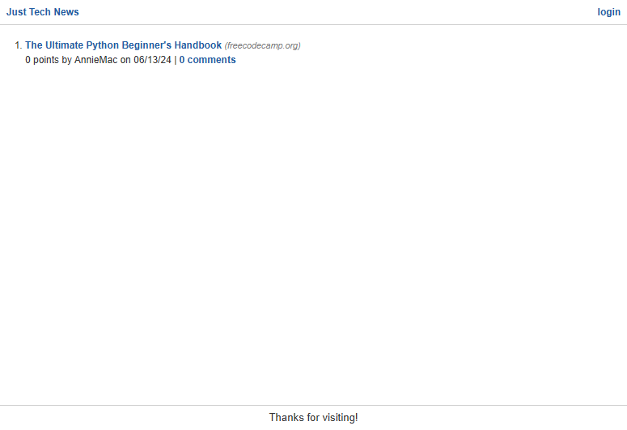
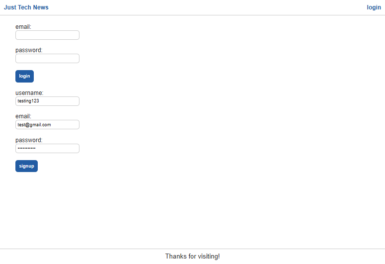
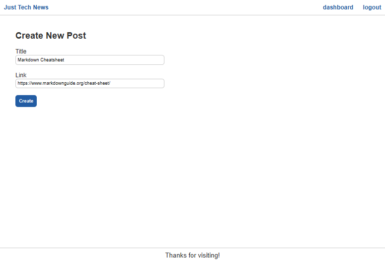
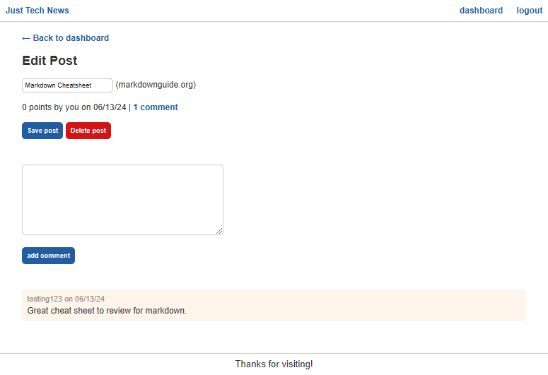
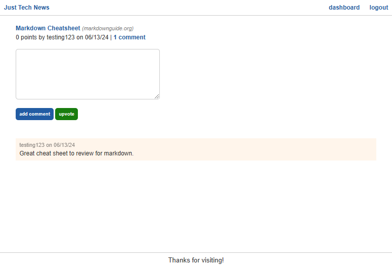

# Just Tech News

## Description
Just Tech News is a website allowing users to share and comment on tech articles and news with other users. The website is built using Python with Flask framework and Jinja2 template engine. This is my first time learning of Python within web development and the website shows my learning.

To visit the website, visit [Just Tech New](https://just-tech-news-python-9f44f031b88d.herokuapp.com/).

### Homepage
Within the homepage you will see a list of the current articles posted by different users along with number of upvotes and comments on eaching posting.

### Login/Signup
A simple login and signup page.

### Dashboard
After logging in or signing up the website will direct users to their personal Dashboard. From here they can create a new post and see a list of their existing postings. This will also allow them the access to edit and/or delete their existing postings.

### Comment and Upvote
Within each individual posting page a user is allowed to add a comment and/or upvote the posting if they so desire.

## Credit
This website was built using starter code provided by edX Bootcamp LLC as part of their continuation courses after their Full Stack Coding Bootcamp with University of Texas, Austin.

